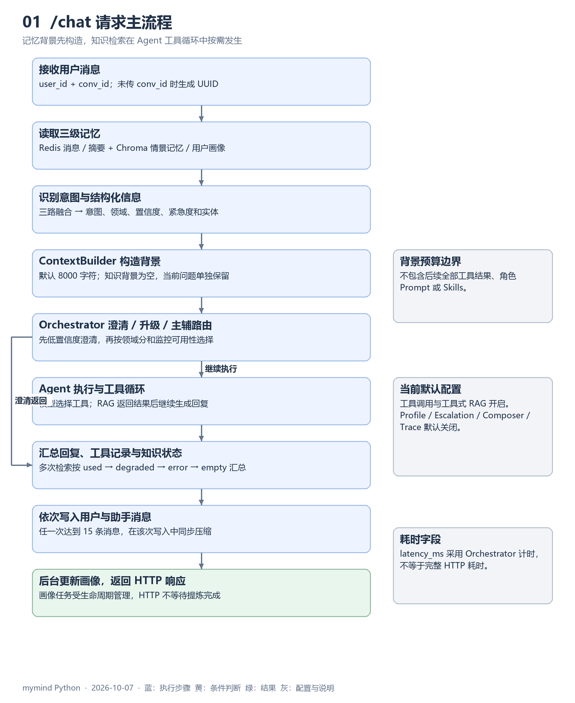
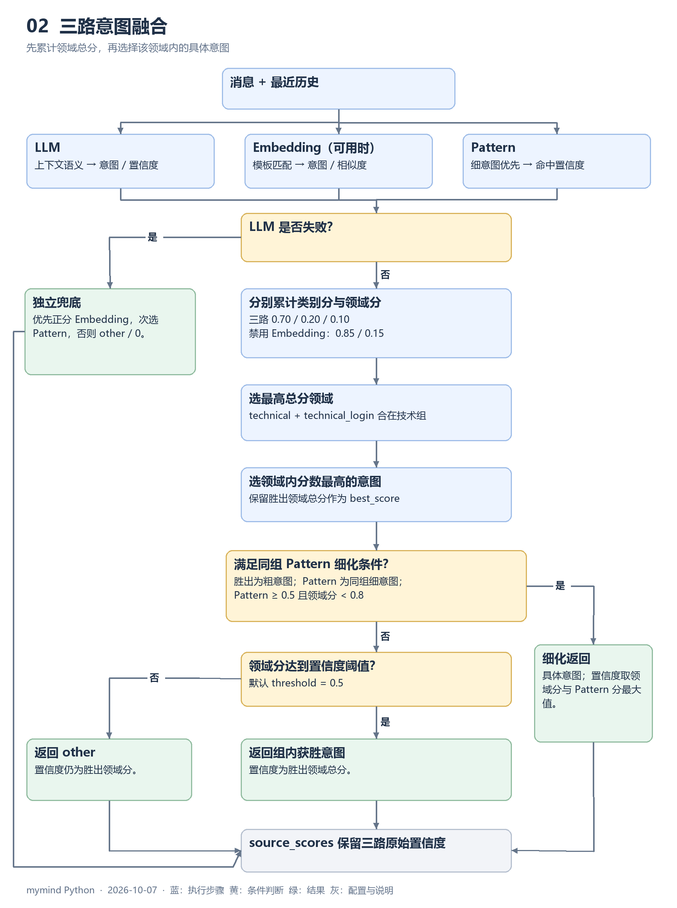
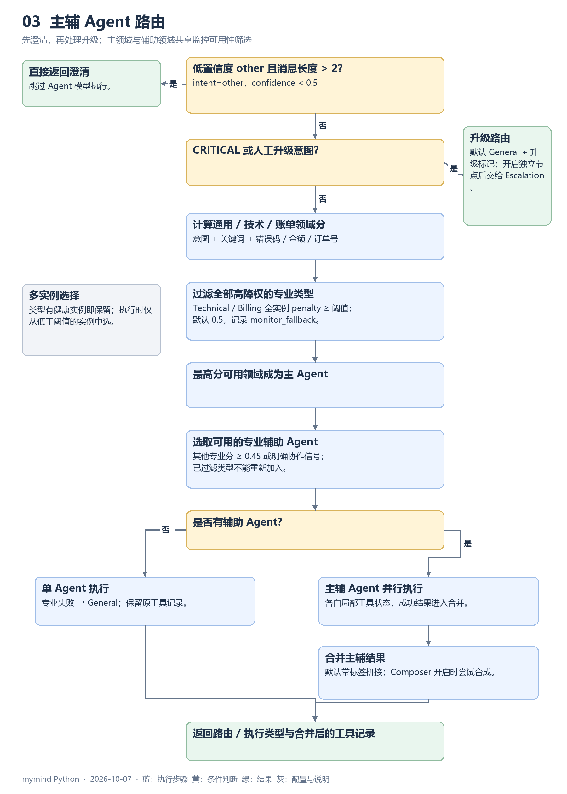
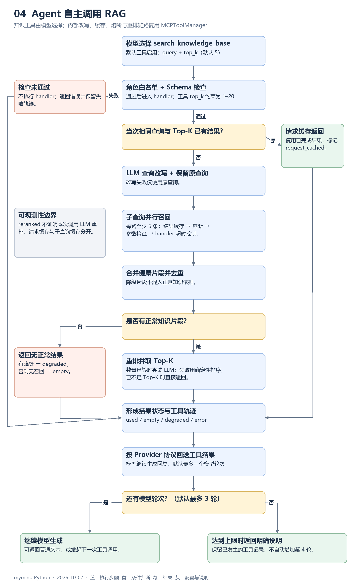
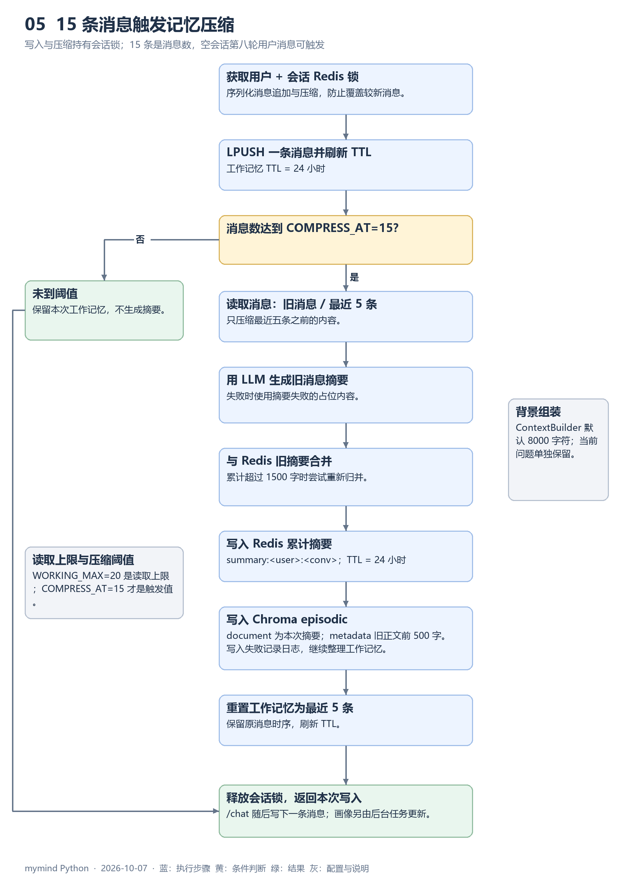

# mymind 学习文档

适用范围：本地 Python 主版本，2026-10-07。本文保留原资料的 `EchoMind学习文档.md` 文件名，内容对应当前 mymind 仓库。

建议先运行 [完整使用指南](完整使用指南.md) 的最小 HTTP 流程，再按本文阅读模块；关键实现的原文节选见 [重点代码](重点代码.md)。

## 1. 项目解决的问题

客服请求常同时包含业务类别、历史背景和需要核验的信息。模型直接生成回复容易忽略领域协作、把未执行操作写成已经完成，或反复携带过多历史。

mymind 将这些问题拆成几类明确职责：意图识别组织业务领域，路由选择主辅 Agent，角色工具提供可执行步骤，知识工具补充业务材料，记忆保存多轮背景，监控和评测检查执行结果。

这是客服场景的 Agent 实现。当前工具能解释错误码、整理诊断步骤、检查账单字段、比较金额和检索资料；真实订单查询、退款、账户修改及工单创建需另行接入业务系统。

## 2. 架构与阅读顺序

| 阅读顺序 | 文件 | 先关注的接口 |
| --- | --- | --- |
| 1 | `api/main.py` | `lifespan()`、`chat()`，组件怎样连接。 |
| 2 | `core/intent_recognizer.py` | `recognize()`、`_vote()`，消息怎样变成领域。 |
| 3 | `agents/agent_orchestrator.py` | `Request`、`RoutingDecision`、`run()`、`_execute()`。 |
| 4 | `agents/tools.py`、`core/llm_gateway.py` | 工具定义与 Provider 协议。 |
| 5 | `mcp/tool_manager.py`、`mcp/knowledge_base.py` | RAG 检索和导入。 |
| 6 | `memory/` | 写入、压缩、画像和背景预算。 |
| 7 | `core/skill_loader.py` | 业务规范怎样加入模型输入。 |
| 8 | `monitor/`、`evaluation/`、`experiments/` | 运行反馈和分层验收。 |

API 在请求开始时读取记忆并识别意图，再构造背景。知识检索发生在选定 Agent 的工具循环里，不位于识别与路由之间。前后顺序决定了哪些诊断信息能进入 Request，哪些结果只能在工具续轮中被模型读取。

### 请求级与共享状态

Orchestrator 的 Agent 池与网关长期复用；统计和配置属于这些共享实例。消息列表、工具调用轨迹、用量聚合属于本次调用；请求工具缓存属于 `Request`。

| 数据结构 | 保存什么 |
| --- | --- |
| `IntentResult` | 具体意图、领域、置信度、紧急度、实体和来源分数。 |
| `Request` | 用户、会话、消息、背景、历史、实体、已识别意图、请求 UUID 和当次工具缓存。 |
| `RoutingDecision` | 主类型、辅助列表、路由原因与置信度。 |
| `AgentCallResult` | 单次 Agent 模型循环的内容、成功状态、缓存元数据、工具记录和用量。 |
| `AgentResponse` | 角色执行结果、耗时、升级标志和工具轨迹。 |
| `OrchestratorResult` | 最终回复、路由/执行类型和合并后的工具记录。 |

这种归属使一个 Agent 能同时处理多个请求，而不会用“最近一次工具结果”覆盖其他请求。

## 3. 意图识别：从粗分类到领域内细分

### 3.1 三路各提供什么

LLM 使用 Few-shot 和最近上下文输出 JSON，适合语义表达和省略信息。Embedding 将消息与模板做余弦匹配，当前客户端缺少远端资源时使用本地字符 n-gram 向量；兼容 Base URL 配置会禁用这一路。Pattern 先匹配细意图关键词，再匹配粗意图，置信度按命中数计算。

三路输出都是一个意图与置信度，不是完整类别概率分布。LLM/Embedding 并行，Pattern 同步执行；融合之后再提取实体和判定紧急度。

### 3.2 为什么先合领域

`technical` 和 `technical_login` 不是互相排斥的业务证据。若逐类别竞争，它们会拆散技术组支持，使账单的单项分数看起来更高。

现在每条加权证据同时写入类别与领域。先取领域总分最大值，再在获胜领域内挑具体意图。技术 `0.04` 加登录 `0.18` 得 `0.22`，可以胜过账单 `0.21`。置信度阈值是随后的一步；弱证据即便领域胜出仍可返回 `other`。

Pattern 只能把当前领域的粗意图细化为同领域具体意图。要满足 Pattern 置信度至少 `0.5`、领域分低于 `0.8`，才使用细化并返回较高置信度。

### 3.3 异常、缓存与纠正样本

LLM 失败后优先使用正分的 Embedding，再使用正分的 Pattern；没有可用证据时返回 `other/0`。来源分数保留原值，不能直接把它们当作融合置信度。

识别缓存使用当前消息和有限历史构造键，避免上下文变化时误复用。`learn()` 将纠正表达加入意图模板并清理对应模板向量，属于运行期样本补充；它没有在当前实现中持久化成新的训练模型。

订单号、日期、金额和错误码由规则提取，供路由与角色输入使用。金额和错误码的语义不同，核对实体时应同时看消息上下文。

## 4. 路由：领域主次与可用性

`run()` 在意图缺失时识别它；API 已识别时直接使用现有结果。低置信度 `other` 满足消息长度条件后先澄清，随后才进入路由。

### 4.1 主辅领域怎样产生

General 初始 `0.1`，其余为零。意图提供主信号，技术/账单意图通常给对应领域 `+0.75`，通用意图给 General `+0.55`；关键词和错误码、金额、订单号再加分。

最高分的可用领域成为主 Agent。其他专业领域达到 `0.45` 或存在明确协作信号时成为辅助，不把 General 加成辅助角色。具体分值见 [业务流程说明](业务流程说明.md)。

“登录报 401，同时重复扣款”可以进入技术+账单协作；不是简单把所有关键词命中都拼成无主次结果。主辅 Agent 共享 Request 背景，但各自用独立模型消息和工具局部状态。

### 4.2 升级与回退

CRITICAL 或明确人工意图进入升级路由。独立 Escalation 默认关闭，General 接待并设置升级标记；开启后生成确定性交接摘要。HIGH 不强制触发升级。

执行故障与监控降权是两条不同路径。故障发生在已经选定 Agent 之后，失败则再执行 General；监控降权在选择时剔除高惩罚实例。全部专业实例达到阈值时，该类型退出主辅候选，路由理由记录 `monitor_fallback`。

单 Agent 回退后 `primary_agent=technical`、`agent_type=general` 可以同时成立：前者是决策，后者是最终执行。并行路径的 `agent_type` 保留决策主类型，成功结果类型见 `agent_types`。

### 4.3 Composer 的职责

Composer 不负责再做业务查询，它只合并已经成功的角色证据。默认关闭时带角色标签拼接；开启后不足两个成功结果会直接使用已有结果，模型合成失败时保留主结论和补充说明。

这使领域协作、工具使用和回复合成可以分别通过 E0–E5 变体评估，而不是一次改变所有行为后只看总分。

## 5. 角色契约、工具与网关

### 5.1 Profile 定义与默认运行

| 角色 | Profile 职责 | 启用 Profile 时的温度/最大输出 |
| --- | --- | --- |
| General | 接待、澄清与分诊 | `0.3 / 900` |
| Technical | 故障诊断与低风险排障 | `0.1 / 1200` |
| Billing | 账单字段核验、金额比较与下一步 | `0.0 / 1100` |
| Escalation | 人工交接摘要 | 确定性实现，不调用模型。 |
| Composer | 主辅回复合成 | `0.1 / 1000` |

Profile 默认关闭，业务角色使用基础 system prompt，首轮 `max_tokens=1024`；不同角色仍有不同的基础职责和工具。Anthropic 协议网关对不含工具调用的空文本或截断响应可单次扩容重试；成功时累计首轮与重试返回的输入、输出和缓存 Token。Profile 参数和首轮生成参数都不能直接替代实际 Token 消耗统计。

### 5.2 工具能力

| 所属角色 | 工具 | 实际作用 |
| --- | --- | --- |
| General | `inspect_request_context` | 读取当次意图、紧急度与实体等脱敏信息。 |
| General | `suggest_required_fields` | 提示下一轮最少补充字段。 |
| Technical | `lookup_error_code` | 解释常见 HTTP 错误码。 |
| Technical | `build_diagnostic_plan` | 根据环境和复现情况组织排障顺序。 |
| Billing | `check_billing_fields` | 核对已有字段，不查真实订单系统。 |
| Billing | `compare_amounts` | 比较两笔已提供金额。 |
| Escalation | `create_handoff_summary` | 定义交接工具；现有升级 handle 直接生成摘要。 |
| 业务 Agent 共享 | `search_knowledge_base` | 经现有工具管理器检索知识片段。 |

工具 Schema、必需字段和角色白名单是执行入口。非法参数或越权调用返回失败给模型并记录轨迹；程序不会执行该处理函数。实际执行的工具名称放入 `tools_used`，检索结果业务失败也不会抹去调用事实。

### 5.3 模型续轮

模型首次得到消息和工具 Schema。若返回 ToolCall，就验证、执行并回送工具结果，再次调用模型；若返回普通文本则结束。默认最多三个模型轮次，第三轮仍要求工具时返回达到上限的说明。

`LLMResult` 统一正文、用量、工具调用与可续轮 assistant 消息。Anthropic 通过 `tool_result` 内容块续轮，OpenAI 协议通过 `role=tool` 消息续轮。这些格式在网关与编排器处理，工具 handler 只关心 Request 和参数。

用量先在网关内累计扩容重试，再由 Agent 累计工具续轮。DeepSeek Anthropic 兼容适配同时规范化缓存字段和 metadata，使统一结果与遥测使用相同口径。例如两次响应返回输入 `100/200`、输出 `20/30` 时，累计报告输入 `300`、输出 `50`。

模型续轮异常时返回 `AgentCallResult(success=false)` 并保留已发生的调用；专业 Agent 的 General 回退继续合并记录。共享实例只累积统计，不保存请求轨迹。

## 6. RAG：触发、召回与状态

### 6.1 谁决定搜索

HTTP 生命周期注册内部 `knowledge_search` handler，并将 `search_knowledge_base` 的 Schema 交给业务 Agent。前者是管理器执行名，后者是模型可见名。

Agent 根据问题与背景发起调用；意图标签不是 API 的强制搜索开关。代码保留 `KnowledgePolicy` 供 R0–R4 实验使用，它没有进入当前 HTTP 聊天主链路或端到端实际工具调用评测。

### 6.2 检索过程

管理器生成约 3 个改写，保留原查询，子查询并行调用知识 handler。原查询+改写数量取决于返回和去重，并非固定执行三次召回。

子查询调用可命中 TTL 缓存；同参数并发请求在缓存路径复查结果，减少重复处理。实际 handler 带超时与三态熔断：默认连续 5 次失败打开，60 秒后允许探测，成功关闭、失败重新打开。

正常片段合并后按稳定 chunk ID 去重。降级片段被排除，不作为正常知识证据；没有正常片段且存在降级时，管理器返回降级失败结果。没有片段且没有降级时返回“所有子查询均无结果”。

重排在片段超过 Top-K 时尝试模型排序，失败使用确定性排序。`reranked=true` 也可能对应跳过实际模型调用或回退排序，不足以证明有效的 LLM rerank 已完成。

### 6.3 知识状态怎样进入 API

共享工具给返回值标记 `used/empty/degraded/error`，Agent 将该状态保留进工具轨迹；API 从同一请求的轨迹汇总，优先级为 `used → degraded → error → empty`，无检索轨迹为 `skipped`。

`knowledge_used` 则来自工具处理是否实际进入。它与片段质量、回答正确性、最终模型是否充分引用知识分别属于不同问题。参数校验失败可有错误轨迹但 `knowledge_used=false`。

## 7. 知识库与检索实验

默认 `KnowledgeBase()` 使用生产 `knowledge_base` collection、句子切块和 Chroma 向量检索，目标片段大小 500 字、无 overlap。Chroma 的默认向量化与意图字符向量不同。

`add_documents()` 生成稳定 ID，提交正文和 metadata 后使用 `upsert`。重复导入相同文档幂等，Embedding 随提交的正文生成。API 导入后使知识缓存失效，并分别返回本次处理量和 collection 总量。

R0–R4 用独立版本化 collection 比较句子/Markdown 切块、cosine、稳定 ID、去重、BM25+RRF 和重排策略。`500+80` 的 Markdown/段落切块属于实验变体，当前服务启动并没有自动选择它。

同标题的内容变更不等于旧文档自动替换：内容与结构可能生成新 ID，当前 upsert 不负责删除原片段。运维和评测时应区分重复导入幂等与版本清理。

## 8. 三级记忆与并发写入

### 8.1 工作、情景与画像

工作记忆按用户+会话保存在 Redis，当前摘要也保存在 Redis，写入刷新 24 小时 TTL。情景记忆按用户检索 Chroma 中的压缩摘要，当前实现不是优先只查本会话再查全局。相关性低于 `0.35` 的结果过滤，再结合相关性与时间排序去重。

用户画像是按用户读取的 JSON 文档，可在跨会话背景中使用。`get_context()` 返回这些结构；当前 HTTP 背景由 ContextBuilder 组装，不直接用旧的 `MemoryContext.to_prompt_text()` 作为最终背景。

### 8.2 为什么在消息写入时压缩

如果只在下一次读取时压缩，工作记忆可能在并发写入后继续增长，且慢摘要会与新消息交错。当前同一会话的 append 与压缩在 Redis 锁内完成，压缩完成后再释放锁。

15 条是触发阈值，保留最近 5 条；空会话每轮写两条，因此第 8 轮用户消息达到 15 时触发压缩，随后助手写入使工作记忆为 6 条。压缩位于 API 记忆写入阶段，会影响用户等待时间，但不包含在 Orchestrator `latency_ms` 的完整端到端计时中。

旧消息摘要与当前累计摘要合并，最大 1500 字；摘要失败有占位结果，再次归并失败截取保留近期摘要内容。情景库保存本次摘要，metadata 的 `full_text` 只有原文前 500 字。

### 8.3 背景预算与画像任务

ContextBuilder 默认背景预算 8000 字符。超预算时先减情景历史、再减画像、较旧工作记忆和摘要，最终限制文本；当前用户问题单独保留在 Request。

这个预算不覆盖稳定角色 Prompt、动态 Skills 和后续所有工具结果，因此不能把它等同于模型总 Token 预算。

画像任务按用户加锁，新用户内容不变或更新间隔不足 600 秒时跳过；模型输出后写回稳定画像 ID。HTTP 后台任务受生命周期管理，画像失败只记录日志，不直接改写已返回的对话结果。

## 9. 缓存与 Skills

### 缓存层次

| 层次 | 键的主要依据 | 避免什么工作 |
| --- | --- | --- |
| 意图结果缓存 | 消息与有限历史 | 重复意图识别。 |
| 工具结果缓存 | 工具、参数、重排需求 | 重复 handler 执行。 |
| 请求工具缓存 | 查询与 Top-K | 当次已完成检索的重复执行。 |
| 用户画像更新控制 | 新用户内容与更新时间 | 重复画像提炼。 |
| Provider Prompt Cache | 稳定 Prompt 与端点协议 | 上游重复前缀处理，效果依供应商遥测。 |

不同缓存不会自动抵消所有模型调用，例如子查询结果命中并不一定跳过改写与最终重排。讨论成本时应统计各模型调用及输入、输出、缓存 Token，不能只报命中率。

### Skills 的注入位置

SkillManager 从目录读取文本或 JSON 规范；角色匹配后，任一关键词命中即可注入。默认单块正文与总 Prompt 都有限长，空内容或解析失败单独跳过并记录。

选定 Agent 后的 `_dynamic_prompt()` 加入匹配 Skill；Profile 开启时还会加角色输入包。这使业务规范能独立于角色代码更新，但 Skill 只是模型输入，不是确定性的结果校验器。

## 10. 监控反馈与 Trace

Monitor 直接读取 Agent 和工具累计统计。成功率低于 `0.90` 加成功率惩罚，超过 3000ms 加延迟惩罚，分别最高 `0.5/0.4`，合计最高 `0.9`。

路由随后使用这些值筛选实例：单专业实例达到 `0.5` 也能导致回退；多实例有健康成员时继续使用该类型，只选择健康成员。辅助协作使用同一可用集合，避免被关键词重新加入。

Trace 对单次请求提供路由、工具参数、执行状态与耗时证据。默认关闭，HTTP 开启后写 Redis，默认 TTL 24 小时、容量 200；通过两个 Trace 接口查询。`/monitor` 的最新背景快照不是请求历史，应通过 request_id 关联轨迹。

## 11. 评测如何回答不同问题

意图评测回答“是否识别正确”，Judge 回答“生成回复质量如何”，路由期望回答“主领域是否正确”，实际知识工具调用期望回答“是否按预期搜索”。这些指标不应互相替代。

Judge 四维平均分达到 `0.75` 是基础通过条件，显式意图/路由/检索期望还会影响用例通过。多轮期望只检查最后一轮；当前指标相对上一报告或 baseline 下降超过 5% 会被记录。

知识调用匹配率低于目标时，检查用例预期、Agent 的知识工具使用规则以及工具开关和注册情况；运行时建议也按这一执行方式生成。

| 数据或实验 | 用途 |
| --- | --- |
| `echomind_smoke.json` | 11 条意图与 5 组对话，`formal_gate=false`。 |
| `agent_migration_dataset.json` | 240 条 Agent 迁移正式数据，六类各 40 条。 |
| `rag_dataset.json`、`rag_corpus.json` | 128 条检索查询及独立语料。 |
| E0–E5 确定性层 | 对同一运行代码进行能力消融，检验契约和策略连接。 |
| 真实 Chroma 层 | 检验真实向量模型的检索表现；代理改写/重排仍需另行区分。 |
| DeepSeek E0/E5 真实层 | 360 个顶层请求与配对 Judge，共享 600 次硬调用预算。 |

E0–E5 明确构造功能配置，不能被当前默认工具开启静默改变；这些 Agent 消融的知识模式仍为 `disabled`。R0–R4 保留确定性知识门控作为检索基准，不代表 HTTP 聊天的强制检索。

## 12. 建议的阅读练习与验证边界

1. 用 `/chat` 连续发送两轮消息，核对用户 ID、会话 ID 和单请求 ID 的区别。
2. 运行意图融合回归，手算技术组 `0.22` 与账单组 `0.21`；区分领域胜出和置信度通过。
3. 阅读同一 Agent 的 401/500 并发工具测试，沿局部变量、AgentResponse 和 Trace Store 追踪隔离。
4. 查看模型续轮失败测试，核对 General 回退为何仍有原技术工具的记录。
5. 比较监控单实例与多实例测试，确认辅助领域也接受可用性过滤。
6. 在假模型 API 测试中比较 `used/empty/degraded/error/skipped`，观察是否调用工具与结果是否有效的区别。
7. 最后再阅读 E0–E5 和 R0–R4 报告，核对数据、Provider、Embedding 和代理策略是否相同。

2026-10-07 的程序回归 86 项通过，覆盖上述主要分支和 E0–E5 离线门禁；API 契约与 Compose 检查通过。历史真实 DeepSeek E0/E5 的质量、Judge 完整性与 Token 成本门禁未通过，当前没有新付费结果替代它。

完整操作命令见 [完整使用指南](完整使用指南.md)，流程阈值与图示见 [业务流程说明](业务流程说明.md)，实现原文见 [重点代码](重点代码.md)。
